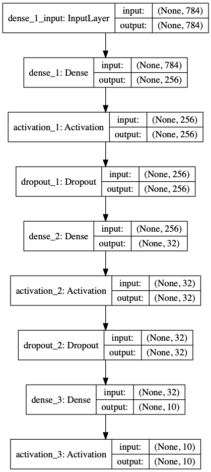

# MLP_GA 

多層マルチーパーセプトロンのハイパーパラメータを遺伝的アルゴリズムを用いて最適化


# code 

各コードについて

- mlp_ga.py
    - GA(遺伝的アルゴリズム)を用いてMLPの最適モデルを導出する
- mlp.py
    - MLPクラス model.pyから呼び出す
- OneMax_GA.py
    - GAのサンプルコード．OneMax問題をGAで解くスクリプト


# Usage

1. please clone my repositori
```
git clone git@github.com:fuchami/MLP_GA.git
```

2. run script on Python3
```
python3 mlp_ga.py
```

# example model



# Requirement

- Software
    - python3.6.3
    - tensorflow==1.7.0
    - keras==2.1.5
    - numpy==1.14.0
    - matplotlib==2.2.2
    - deap==1.2.2